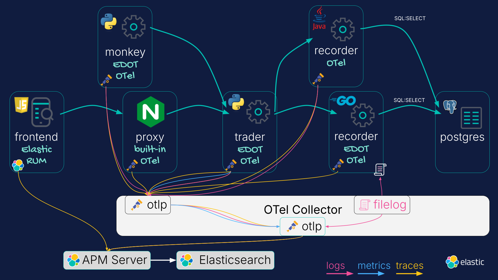

# Non-Instruqt

If operating outside of Instruqt (on your own laptop, to your own Elasticsearch cluster), you will need to provide appropriate credentials. Create a `.env` file in this directory with the following variables define:

```
ELASTIC_APM_SERVER_ENDPOINT=
ELASTIC_APM_SERVER_SECRET=
ELASTIC_APM_SERVER_RUM_ENDPOINT=
ELASTIC_APM_SERVER_RUM_CREDENTIALS=false
```

And then load the variables
```export source .env```

# Building

1. Open a Terminal in VS Code (drag divider from bottom)
2. `cd` to `/workspace`
3. `./supports.sh`
4. `docker-compose build`

# Running

1. `docker-compose up`

# Playing around

* use the "TradeMaster2000" Instruqt tab (or `http://127.0.0.1:9394` if running locally) to interact with the UI
* use the "Elastic - APM" tab (or visit your Elastic cluster) to interact with Elastic APM

# Architecture


